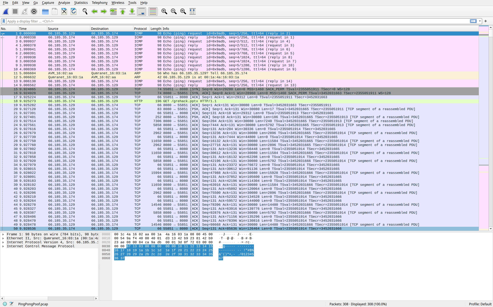
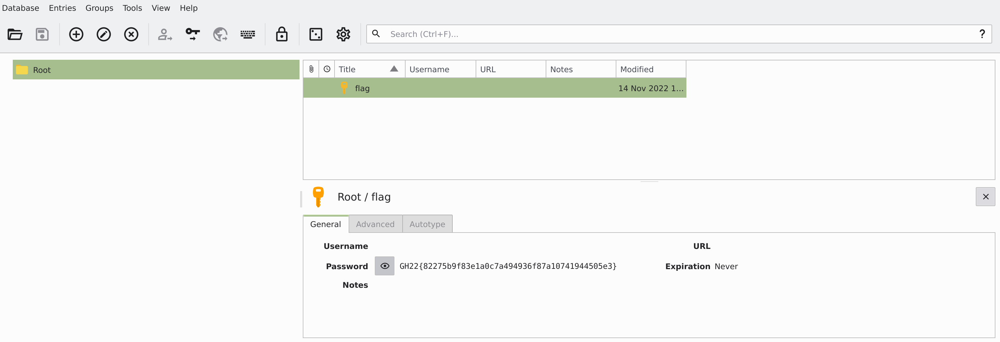

# GreHack 22 CTF - PingPongPoof

The challenge consisted in retrieving the flag from this file: [PingPongPoof.pcap](PingPoogPoof.pcap)

## PCAP analysis
Let's open the pcap file with wireshark: 



There is mainly two type of packets, TCP packets triggered by a `HTTP GET` ohver `/grehack.pptx` and ICMP packets.

This is plain HTTP, no TLS, so let's retrieve `grehack.pptx` file with tshark:

`$ tshark -r PingPongPoof.pcap --export-objects 'http,data'`

This will extract data into `data` folder
```bash
$ ls data 
grehack.pptx
```

In the `grehack.pptx` file, there are 5 slides containing wikipedia pages of:
* Base64
* KeePass
* ROT13
* ICMP
* QR code

After analysis the PCAP file, it appears that ICMP packets contained some data. Let's extract them using python:
```python
from pcapfile import savefile
import binascii

file = open('PingPongPoof.pcap','rb')
pcapfile = savefile.load_savefile(file,verbose=True)

m = b''
for p in pcapfile.packets:
    if p.packet[:4] == b'001a' and len(p.packet) == 196 and p.packet[-10:] != b'3334353637':
        print(len(p.packet),p.packet[84:])
        m += p.packet[84:]
print(m)

f = open('gh.kdbx','wb')
f.write(binasii.unhexlify(m))
f.close()

```

It turns out that it contains a keypass database file from the slides cover KeePass and ICMP ...
* Base64
* (x) KeePass
* ROT13
* (x) ICMP
* QR code

I ran John The Ripper over that keypass database using `keepass2john` but after 30 minutes, I decided that it wasn't the right path.

The QR Code slide contains a truncated QR Code but after trying several method to recover it, I failed. @Azox suggested me to reset the image and it would probably reset the crop : BOOOM!

Once flashed, the QR Code contained: `ovVcrmx5GK5LDGc7BRc0IJZ/D2y3ExuMWQ8zLN==`

* Base64
* (x) KeePass
* ROT13
* (x) ICMP
* (x) QR code

It seems that we should used Base64 and ROT13. What is the order ?! Let's try

Using https://v2.cryptii.com/base64/rot13 and https://v2.cryptii.com/rot13/base64 we do exactly this:

https://v2.cryptii.com/base64/text: ovVcrmx5GK5LDGc7BRc0IJZ/D2y3ExuMWQ8zLN== => ⵜt;4 濏y瓛왏3,

https://v2.cryptii.com/rot13/text: ovVcrmx5GK5LDGc7BRc0IJZ/D2y3ExuMWQ8zLN== => biIpezk5TX5YQTp7OEp0VWM/Q2l3RkhZJD8mYA==

```bash
$ echo -ne "biIpezk5TX5YQTp7OEp0VWM/Q2l3RkhZJD8mYA==" | base64 -d
n"){99M~XA:{8JtUc?CiwFHY$?&`
```
* (x) Base64
* (x) KeePass
* (x) ROT13
* (x) ICMP
* (x) QR code

Let's use this output as a password to the keepass kdbx file. I used keepassxc:




FLAG: `GH22{82275b9f83e1a0c7a494936f87a10741944505e3}`